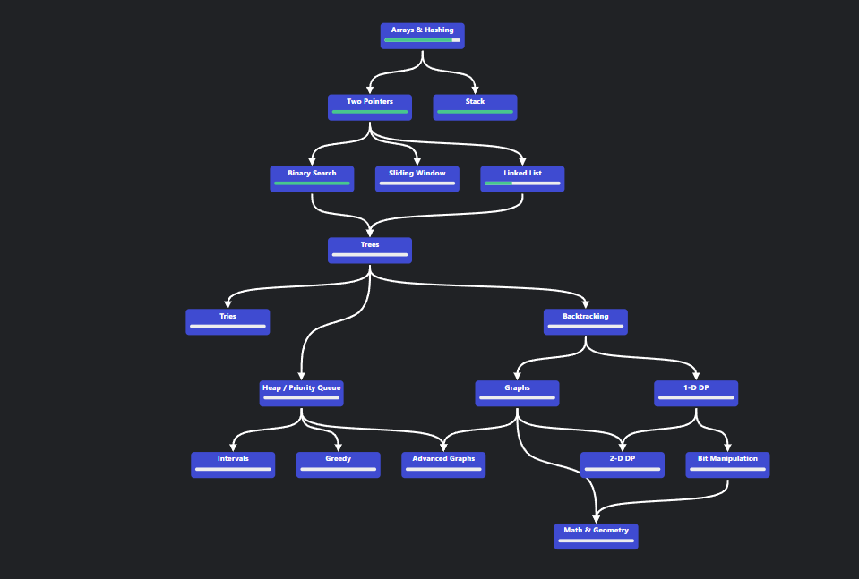

# Data Structures and Algorithms in Python

# Overview
This repository contains implementations of various Data Structures and Algorithms (DSA) in Python. The implementations are based on the roadmap provided by neetcode.io.

# Roadmap
The roadmap followed in this repository is structured according to the guidance provided by www.neetcode.io . It covers a comprehensive set of topics ranging from basic to advanced data structures and algorithms. The roadmap aims to guide learners through a progressive journey in mastering DSA concepts and their practical implementations.

You can find the detailed roadmap at neetcode.io.

